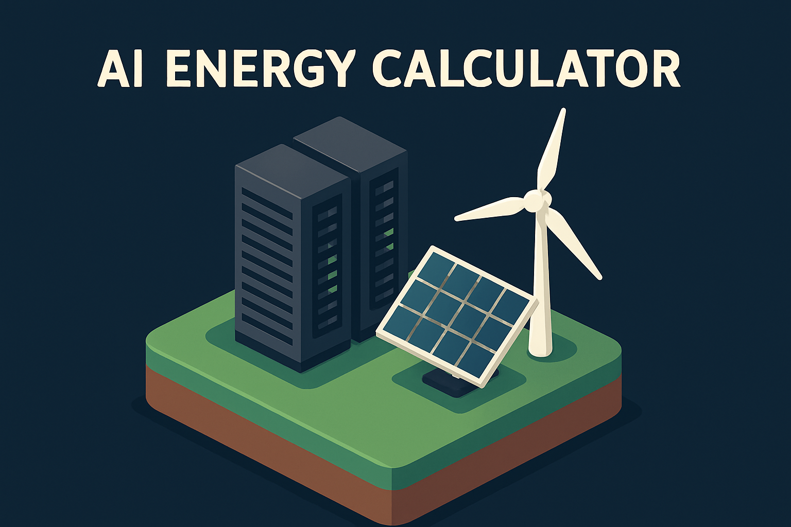

# AI Energy Calculator 🌎⚡️

[Live Demo → calculeai.com](https://www.calculeai.com)

Estimate **energy use, cost, and CO₂ emissions** of large-language-model inference in real time.

<p align="center">
  <picture>
    <source media="(prefers-color-scheme: dark)" srcset="public/og-image.png">
    
  </picture>
</p>

## ✨ Why this project?

Generative AI is amazing—but it comes with an energy bill.  This tool makes the environmental and economic impact of LLM inference **transparent & actionable** for engineers, researchers, and product teams.

* 📊 **Instant feedback** – tweak model, precision, tokens, location, electricity price & more
* ⚙️ **Research-backed formulae** – FLOP analysis + region-specific grid intensity
* 🌐 **Global perspective** – compare 15+ grid regions from Iceland to Australia
* 💰 **Cost breakdown** – see dollars _and_ kWh for any workload size
* 🍃 **Carbon insights** – quantify CO₂ per token and total session

> "What gets measured gets managed." – Peter Drucker

## 🔥 Quick start

```bash
pnpm install
pnpm dev # then visit http://localhost:3000
```

## 🧠 Calculation methodology

1. **Total FLOPs**  \(F = 2\times N_{params}\times T\)  
2. **Energy (kWh)**  \(E = \dfrac{F}{\eta}\div 3.6\times 10^{6}\)  
3. **PUE overhead**  \(E_{total} = E \times \text{PUE}\)  
4. **Carbon**  \(CO₂ = E_{total} \times I_{grid}\)

Key assumptions:

* NVIDIA H100 efficiency: **6.59×10¹¹ FLOPs/J** (conservative)
* Precision multipliers: FP32 (1×), FP16 (2×), FP8 (4×)
* Region-specific carbon intensity from latest open-data sets

_Sources: Hopper et al. (2023), Özcan et al. (2023)_

## 🏗️ Tech stack

* [Next.js 13 App Router](https://nextjs.org)
* [React-Server Components](https://react.dev)
* TypeScript, Tailwind CSS, Shad-cn UI
* Vercel Analytics for usage insights

## 📈 Roadmap

- [ ] GPU benchmarking integration
- [ ] Batch vs streaming inference toggle
- [ ] Export to CSV / JSON
- [ ] **Your idea?** Open an issue!

## 💖 Contributing

1. Fork & `git clone`
2. Create a feature branch
3. `pnpm run lint && pnpm run test` (coming soon)
4. PR away – we love contributions of **all** sizes!

## ⭐️ Support the project

If this project helps you understand or reduce AI energy usage, please **star this repo** and share with a friend. It fuels further development! 🙏

---

Made with ❤️ by [@michael_chomsky](https://twitter.com/michael_chomksy) – MIT license
